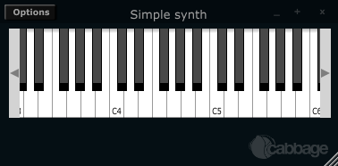

# Your first Cabbage instrument
The following section illustrates the steps involved in building a simple Cabbage instrument. It is assumed that the user has some prior knowledge of Csound. For a list of Csound tutorials and resources please visit the [Csound Homepage](www.csound.com). Each Cabbage instrument is defined in a simple text file with a .csd extension. The syntax used to create GUI widgets is quite straightforward and should be provided within special xml-style tags <Cabbage> and </Cabbage> which can appear either above or below Csound's own <CsoundSynthesizer> tags. Each line of Cabbage specific code relates to one GUI widget only. The attributes of each widget are set using different identifiers such as colour(), channel(), size() etc. Where identifiers are not used, Cabbage will use the default values. Long lines can be broken up with a '\' placed at the end of a line. 

Each and every Cabbage widget has 4 common parameters: position on screen(x, y) and size(width, height). Apart from position and size all other parameters are optional and if left out default values will be assigned. To set widget parameters you will need to use an appropriate identifier after the widget name. More information on the various widgets and identifiers available in Cabbage can be found in the Cabbage Widgets section of these docs.

## A basic Cabbage synthesiser

Code to create the most basic of Cabbage synthesisers is presented below. This instrument uses the MIDI interop command line flags to pipe MIDI data directly to p-fields in instrument 1. In this case all MIDI pitch data is being written directly to a special variable named p4 while all MIDI amplitude data is written to variable called p5. MIDI data being sent on channel 1 will cause instrument 1 to play. Data being sent on channel 2 will cause instrument 2 to play(if one was defined), and so on. If you wish to assign an instrument to a unique MIDI channel you can use the 'massign' opcode. 

##Example
```html
<Cabbage>
form size(380, 160), caption("Simple synth"), pluginID("plu1")
keyboard bounds(12, 6, 360, 100)
</Cabbage>
<CsoundSynthesizer>
<CsOptions>
-n -d -+rtmidi=NULL -M0 --midi-key-cps=4 --midi-velocity-amp=5
</CsOptions>
<CsInstruments>
sr = 44100
ksmps = 64
nchnls = 2
0dbfs=1

instr 1
a1 oscili p5, p4, 1
outs a1, a1
endin

</CsInstruments>  
<CsScore>
f1 0 1024 10 1
f0 3600
</CsScore>
</CsoundSynthesizer>
```
>You'll notice that a '-n' and '-d' are passed to Csound in the CsOptions section. -n stops Csound from writing audio to disk. The '-d' prevents any FLTK widgets from displaying. These flags are now set by defaul in Cabbage so you no longer need to pass them in the CsOpyions. You will also notice that our instrument is stereo. All Cabbage instruments are stereo. 

