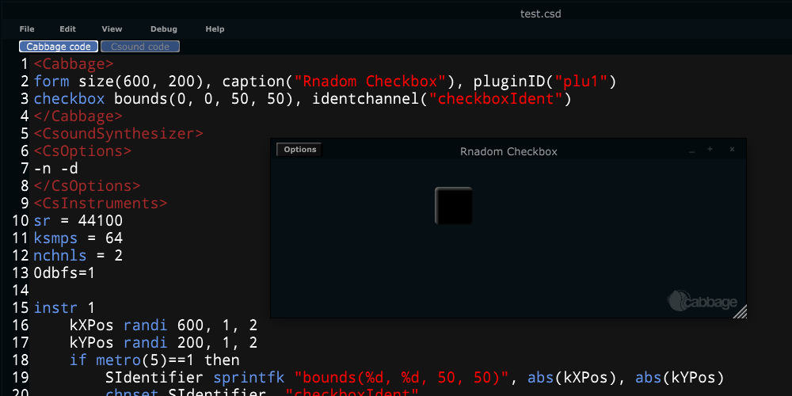

# Controlling Widgets from Csound
All widget identifiers can be updated in real-time if an identifier channel has been set up using an identchannel() identifier. Once an identifier channel has been set up, one can update a widget's identifier using a chnset opcode in Csound, with the appropriate ident-channel string. For example, if one sets up a checkbox with an identifier channel "checkboxIdent", its position can be controlled using Csound and a chnset opcode.

```csharp
chnset "bounds(10, 10, 100, 100)", "checkboxIdent"
```

To control the position of a checkbox in real-time, one can use the **sprintfk** opcode to dynamically create an identifier string that can be passed to the widget. In this example random values are passed to sprintfk to create a new bounds() strings 5 times a second. **metro(5)**



Identifier channels can also be used with <<plants, Plants>>. In the following example, 3 plants, containing 4 hsliders each are placed on top of each other. One has visible() set to 1, while the others have visible() set to 0. When the instrument first launches, the users sees only one of the slider plants. As the user clicks on the button marked toggle, they can show and hide the other plants. 


While Cabbage comes with several fun animation examples, please keep in mind that it is not a fraemwork for developing animations! The more widgets you manipulate, and the speed at which you modify them at will inevitably cause a drain on the CPU. The key here is to only call chnset when it is absolutely required. 